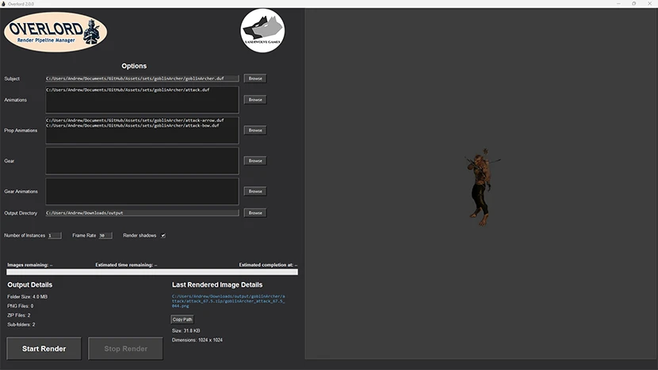

## An Asset Creation Pipeline Management Tool
#### Overlord uses [Daz Studio](https://www.daz3d.com/) and [NVIDIA Iray](https://www.nvidia.com/en-us/design-visualization/iray/) to create assets for [Construct](https://www.construct.net/en) games, like [DaggerQuest](https://www.DaggerQuest.com/) and [Plains of Shinar](https://PlainsOfShinar.com/).


## Installation

### Prerequisites
- **DAZ Studio 4**: Download and install from [Daz3d.com](https://www.daz3d.com/get_studio)
- **Iray Server**: Download and install from [IrayPlugins.com](https://www.irayplugins.com/)
- **Python 3.8+**: Required for running from source or building locally. Download and install from [Python.org](https://www.python.org/downloads/).

### Option 1: Install from Release (Recommended)
1. Browse to the [latest release](https://github.com/Laserwolve-Games/Overlord/releases/latest)
2. Download and run the `OverlordInstaller` executable

### Option 2: Run from Source
1. Clone this repository:
   ```bash
   git clone https://github.com/Laserwolve-Games/Overlord.git
   cd Overlord
   ```

2. Install Python dependencies:
   ```bash
   pip install -r requirements.txt
   ```

3. Run the application:
   ```bash
   python src/overlord.py
   ```

### Option 3: Build Locally
If you want to create your own executable and installer:

1. Clone this repository and navigate to the directory
2. Run the build script:
   ```bash
   python scripts/build.py
   ```
3. The script will prompt for a version number and automatically:
   - Install required dependencies
   - Build the executable
   - Create the Windows installer (if Inno Setup is available)

For detailed build instructions, see [BUILD.md](BUILD.md).

## Usage

### Getting Started
1. Launch Overlord
2. Configure your **Source Sets** - folders containing your DAZ assets (.duf files)
3. Set your **Output Directory** - where rendered images will be saved
4. Adjust rendering parameters as needed
5. Click **Start Render** to begin

### Source Sets
Source Sets are folders containing your DAZ asset files. Overlord recognizes these file types:
- `*_subject.duf` - This is a Scene Subset of either a figure or an object
- `*_animation.duf` - These are Pose Presets for the subject
- `*_gear.duf` - These are Wearables Presets for the subject
- `*_propAnimation.duf` - These are Pose Presets for objects included with the subject file
- `*_gearAnimation.duf` - These are Pose Presets for the gear files

Example Source Set directories are coming soon.

### Settings
All your settings are automatically saved and restored when you restart Overlord:
- **Source Sets**: Your selected asset folders
- **Output Directory**: Where images are saved
- **Number of Instances**: How many DAZ Studio processes to run simultaneously
- **Frame Rate**: Animation frame rate for video exports
- **Log File Size**: Maximum size for log files
- **Render Shadows**: Whether to render shadow variants

### Features

#### Real-time Monitoring
- **Source Set Details**: Live count of assets in your source folders
- **Output Details**: Real-time statistics of your output folder
- **Last Rendered Image**: Preview of the most recently rendered image
- **Progress Tracking**: Visual progress bar and time estimates
- **Console Output**: Live feed of rendering status and operations

#### Rendering Management
- **Multi-instance Rendering**: Run multiple DAZ Studio instances for faster processing
- **Background Processing**: Continue working while renders run in background
- **Process Control**: Stop all DAZ Studio instances with one click
- **Shadow Variants**: Indicate whether or not to also render shadows

#### Construct Archiver
- **File zipper**: Archive rendered images so they can be drag and dropped into Construct.

### File Locations
- **Settings**: `%APPDATA%/Overlord/settings.json`
- **Logs**: `%APPDATA%/Overlord/log.txt`
- **Scripts**: `%APPDATA%/Overlord/scripts/` (when running as executable)

### Troubleshooting

#### DAZ Studio Not Found
- Ensure DAZ Studio is installed in the default location: `C:\Program Files\DAZ 3D\DAZStudio4\`
- Check that the executable exists at the expected path

#### Rendering Issues
- Verify your source sets contain valid `.duf` files
- Check the console output for error messages
- Review the log file at `%APPDATA%/Overlord/log.txt`

## License
This project is licensed under the [AGPL 3.0 License](https://www.gnu.org/licenses/agpl-3.0.html.en) - see the [LICENSE](LICENSE) file for details.

## Contributing
Contributions are welcome! Please feel free to submit a Pull Request.

## Support
For issues and support, please visit the [Issues](https://github.com/Laserwolve-Games/Overlord/issues) page.
